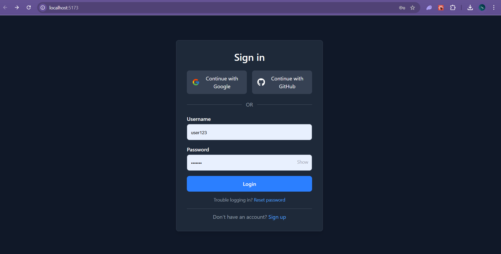
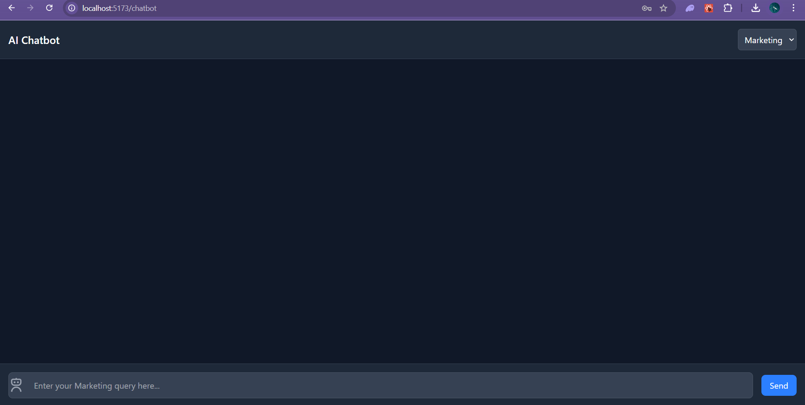

# AI Chatbot Screen

This is a ReactJS-based AI chatbot screen with a login screen and a chatbot interface. The application simulates the log in using Google, GitHub, or email/password, and interact with an AI chatbot. The chatbot screen dynamically changes the placeholder text based on the selected department.

## Features

- **Login Screen**:
  - Login with Google, GitHub, or email/password.
  - Show/hide password functionality.
  - Reset password and sign-up options.
  - Loading screen during login.

- **Chatbot Screen**:
  - Dynamic placeholder text based on the selected department (Marketing or Sales).
  - Real-time chat interface with user and bot messages.
  - Responsive design for various screen sizes.

## Screenshots

### Login Screen
 <!-- Add your login screen image here -->

### Chatbot Screen
 <!-- Add your chatbot screen image here -->

## Technologies Used

- **Frontend**:
  - ReactJS
  - Tailwind CSS (for styling)
  - React Router (for navigation)
  - React Icons (for icons)

- **Development Tools**:
  - Vite (for fast development setup)
  - ESLint (for code linting)
  - Prettier (for code formatting)

## Setup Instructions

### Prerequisites

- Node.js (v16 or higher)
- npm (v8 or higher)

### Steps to Run the Project

1. **Clone the Repository:**
   ```bash
   git clone https://github.com/cranyax/projects/ai-chatbot.git
   cd ai-chatbot
   ```

2. **Install Dependencies:**

    ```bash
    npm install
    ```

3. **Run the Development Server:**

    ```bash
    npm run dev
    ```

4. **Open the Application:**

The application will be running at http://localhost:5173.