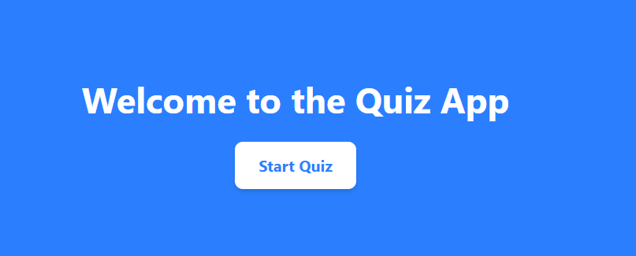
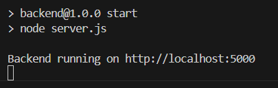
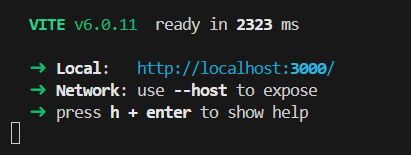

# Quiz Game Application

## Project Overview

This is a full-stack quiz game built with a **React frontend** and an **Express backend**. The app allows users to answer multiple-choice quiz questions and provides feedback on whether their answers are correct or incorrect. The quiz is gamified with a streak system, animations, timers, and a smooth user interface.

### Features:
- Displaying quiz questions with multiple-choice options.
- Showing feedback after selecting an answer (correct or incorrect).
- A timer for each question with an auto-move feature after the time runs out.
- Option to manually move to the next question with a "Next" button.
- **Streak system** that tracks consecutive correct answers.
- **Smooth animations** using `framer-motion` for transitions and button animations.
- **Backend API** that fetches quiz data from an external source.




---

## Setup Instructions

### 1. Clone the repository

```bash
git clone https://github.com/cranyax/projects/quiz-app.git
cd quiz-app
```

### 2. Setting up the Backend

- Navigate to the backend directory.
```bash
 cd backend
```

- Install backend dependencies.
```bash
 npm install
```

- Start the backend server.
```bash
 npm start
```

- The backend will now be running on http://localhost:5000.


### 3. Setting up the Frontend

- Navigate to the frontend directory.
```bash
 cd frontend
```

- Install frontend dependencies.
```bash
 npm install
```

- Start the React development server.
```bash
 npm run dev
```

- The frontend will now be running on http://localhost:3000.



### 4. Access the Application

- Open your browser and go to http://localhost:3000 to access the quiz game.

- The app will fetch quiz data from the backend, display questions, and allow users to answer them.


## Dependencies

### Backend:

- express: A minimal and flexible Node.js web application framework.
- axios: A promise-based HTTP client for making requests.
- cors: A package to allow cross-origin resource sharing.

### Frontend:
- react: React library for building the user interface.
- axios: To make HTTP requests to the backend.
- framer-motion: For smooth animations.
- tailwindcss: For utility-first CSS styling.

### Application Flow

- The frontend fetches quiz data from the backend API (/api/quiz).
- The user is presented with a quiz question and multiple-choice options.
- After selecting an option:
-  The app shows whether the answer was correct or incorrect.
- The "Next" button becomes enabled after a timer runs out or after the user clicks it.
- The user’s streak is tracked, showing consecutive correct answers.
- After completing the quiz, the user’s score and streak are displayed.